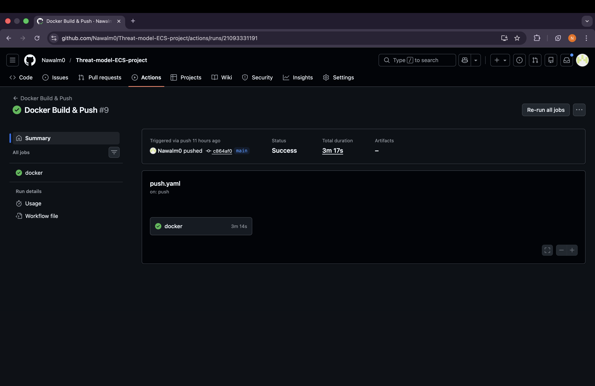
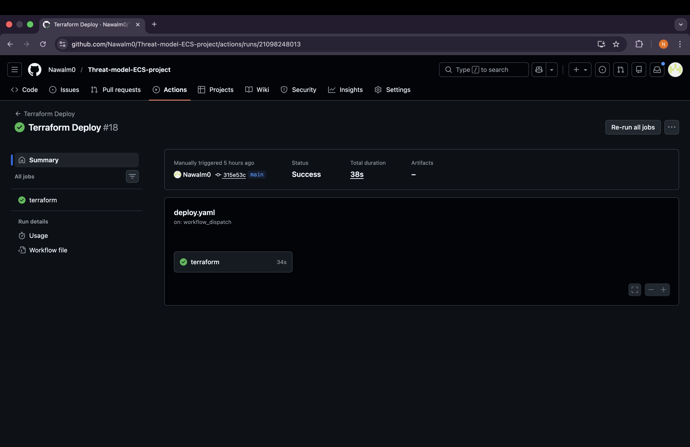

# End-to-End Deployment of Threat-Composer on AWS ECS Fargate

This project demonstrates the deployment of Threat-Composer, an open-source threat-modelling tool, using AWS ECS Fargate, Terraform, and GitHub Actions CI/CD.
The setup follows modern cloud and DevOps best practices, including Infrastructure as Code and OIDC authentication

## Architecture Diagram


## Overview

- Deployed using AWS ECS Fargate (serverless containers)
- Secured with HTTPS (ACM + ALB)
- Fully automated using Terraform and GitHub Actions
- Uses OIDC for AWS authentication (no static AWS keys)

## Directory Structure
```bash
.
├── app/
│   └── Dockerfile
├── terraform/
│   ├── main.tf
│   ├── provider.tf
│   ├── variables.tf
│   ├── outputs.tf
│   └── modules/
│       ├── acm/
│       ├── alb/
│       ├── ecs_fargate/
│       ├── iam/
│       ├── security_groups/
│       └── vpc/
└── .github/
    └── workflows/
        ├── deploy.yaml
        └── push.yml

```
## Local App Setup

```
yarn install
yarn build
yarn global add serve
serve -s build
```
then go to http://localhost:3000
## Key Components
### Docker
 - The app/Dockerfile defines how the Threat Composer app is packaged into a container image.

### Terraform (Infrastructure as Code)
- ECS Fargate runs the containerised application.
- Application Load Balancer (ALB) forwards traffic to the ECS service.
- Route 53 manages DNS for the domain.
- ACM (AWS Certificate Manager) issues and manages the TLS certificate for HTTPS.
- Security Groups control inbound and outbound traffic.
- VPC provides the networking layer, including public subnets, and Internet Gateway.
- Remote State is stored in S3, with state locking enabled to reduce the risk of conflicting changes.

### CI/CD (GitHub Actions)
- Docker push and Terraform deploy all automated using GitHub actions
- Manual workflows to prevent any unwanted changes
- Secrets & sensitive data stored in GitHub secrets to enforce principle of least privillege and prevent information being compromised
  
 ## Domain page
 

 ## Docker Build and Push to ECR
  

 
 ## Terraform deploy
 